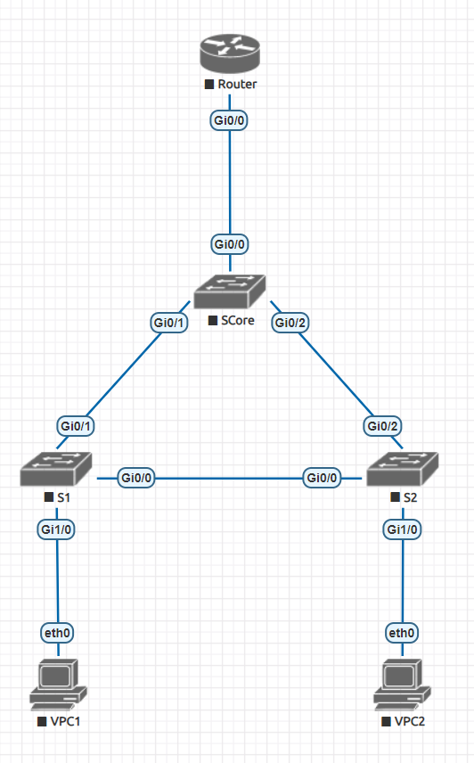
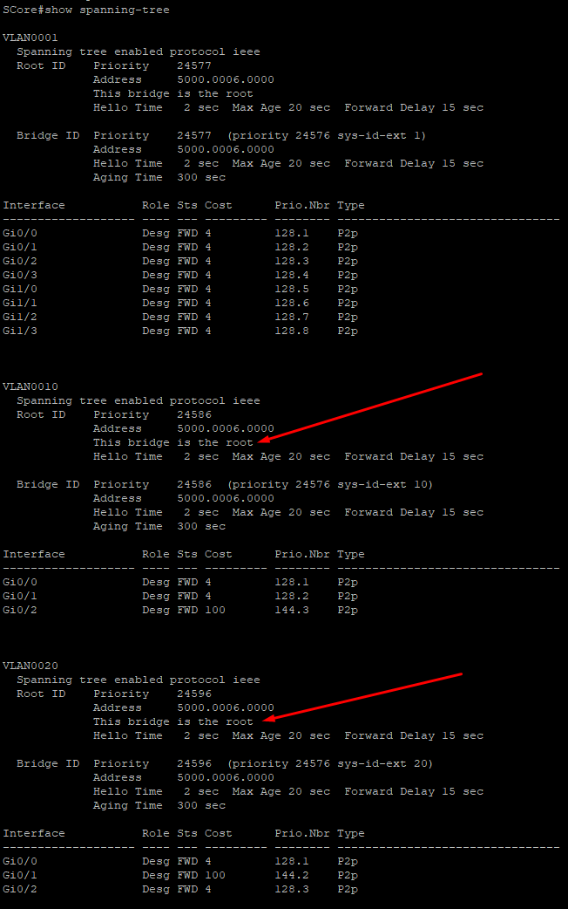
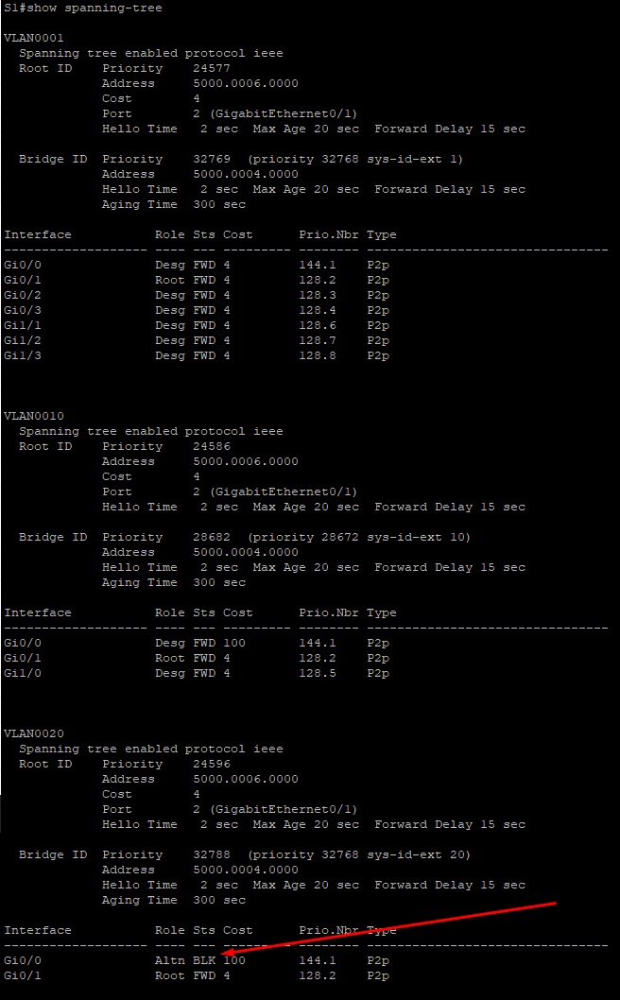
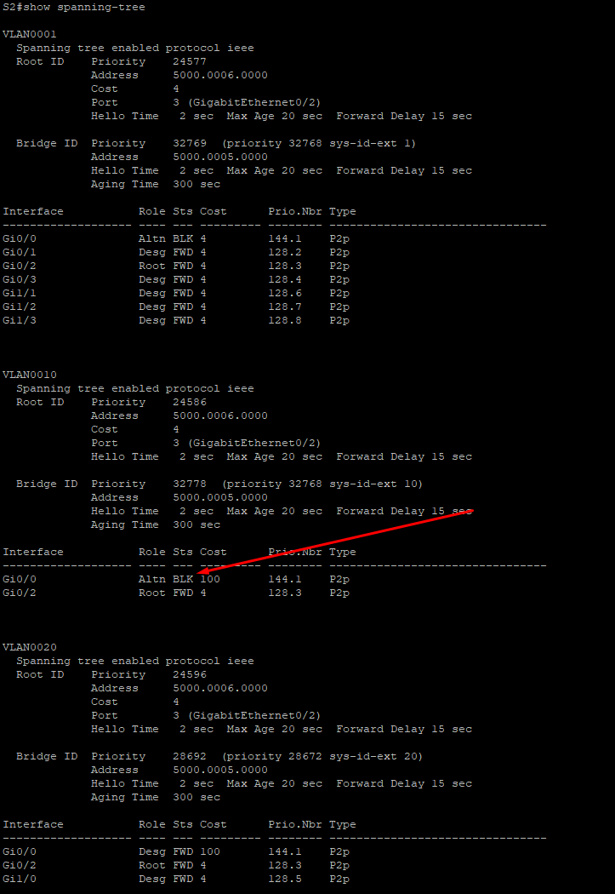
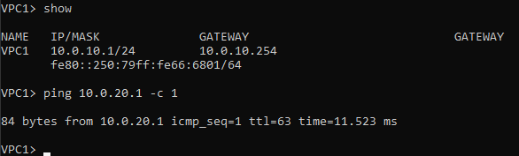
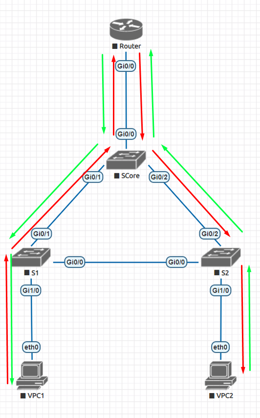
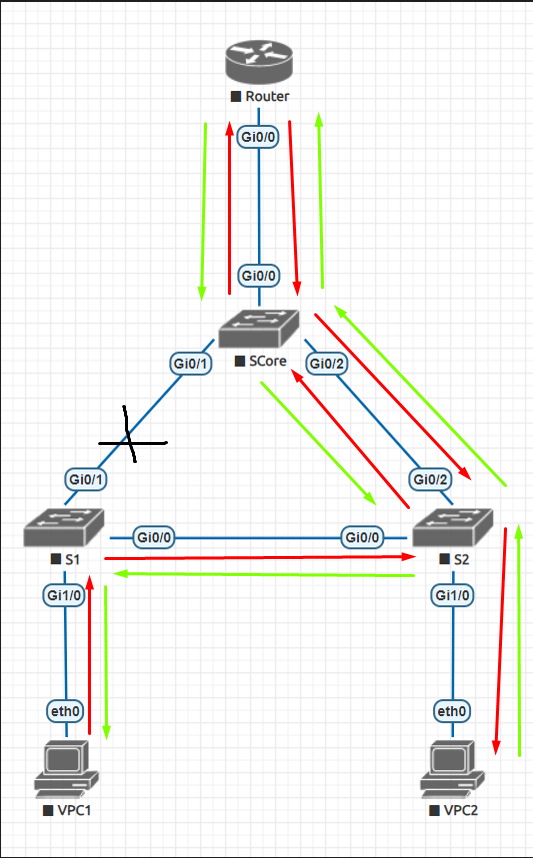
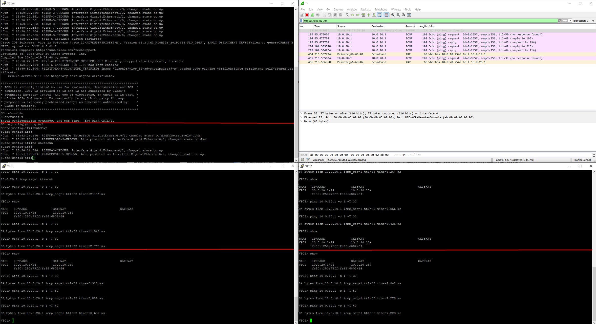

# Lab1

## 1) Топология

## 2) VLAN и LAN

VPC1 имеет IP 10.0.10.1/24 (см Configs/VPC1.conf#L2)

VPC2 имеет IP 10.0.20.1/24 (см Configs/VPC2.conf#L2)

GI1/0 у S1 находится в VLAN 10 (см Configs/S1.conf#L73)

GI1/0 у S2 находится в VLAN 20 (см Configs/S2.conf#L73)

## 3) STP

Корень VLAN:

Заблокированный линк у S1:

Заблокированный линк у S2:

## 4) Ping 

VPC1 -> VPC2

VPC2 -> VPC1

## 5) EVE-NG

Экспортированный файл из EVE-NG - Lab1.unl

## 6) Отказоустойчивость

Если я правильно понял, то под этим пунктом имеется ввиду, что если условные крысы перегрызут один из 3 кабелей соединяющих коммутаторы, то сеть сохранит работоспособность.

Продемонстрировать это можно следующим экспериментом:

1) В изначальной конфигурации отослать по одному пингу. Они пойдут по следующим путям: (крайсный - запрос, зелёный - ответ) 

2) Затем на SCore отключить gi0/1 и подождать некоторое время для перестройки топологии через STP
3) Отправить вторую группу пингов. Они пойдут по следующим путям: 

4) Затем на SCore включить gi0/1 и подождать некоторое время для перестройки топологии через STP
5) Отправить третью группу пингов. Они пойдут по исходным путям:

Таким образом если проследить за пакетами через линк между S1 и S2, то мы должны увидеть только пакеты второй группы пингов

Снизу приведён скриншот этого эксперемента, на нём есть 3 окна putty (VPC1, VPC2, SCore) и захват порта gi0/0 у S2. Во время эксперимента вводились только команды ниже красных линий.
Так же скриншоте один запрос из третьей группы успел таки пройти по этому линку до полной перестройки STP.

## Итог

Всё сделано)
